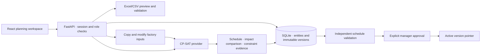

# Architecture

## V3 additions

React now submits `/api/jobs` requests to a bounded single-worker executor with persisted QUEUED/RUNNING/COMPLETED/FAILED/INTERRUPTED states. The existing synchronous API remains compatible. Jobs never publish; startup marks abandoned work interrupted. Database-local fingerprints reuse identical results while freshness evidence is recalculated. New modules `intelligence.py`, `cache.py` and `jobs.py` isolate decision context, caching and execution.

New SQLite tables: decisions, solve_cache, solve_jobs and import_backups. Schema version is 3; additions are idempotent, not a PostgreSQL migration framework. Inputs still normalize through Factory. Quality/order holds block scheduling without erasing commitments. A persisted review rejection prevents activation. Extended onboarding supports source-header mapping and rollback only at the matching applied revision. See DOMAIN_MODEL, SCENARIO_ENGINE and KNOWN_LIMITATIONS for the current contract.

## Components

`backend/models.py` is the domain input contract. Pydantic rejects unknown fields, invalid values, duplicates and broken references. Models cover customer, product, order, routing/operation/alternative, resource, material/replenishment, calendar, maintenance window, auxiliary operator/tool, supplier and optimization settings. Jobs and delivery projections are derived from typed orders and persisted in each schedule result.

`backend/engine.py` defines `SolverProvider` and its CP-SAT implementation. Input time is integer minutes from a plant-local midnight epoch. Calendar windows are merged across adjacent shifts and reduced by unavailable events. Intersection with tool and operator calendars produces valid start domains. Optional intervals bind alternatives to global start/end variables. Capacity uses cumulative intervals, so tools and operator crews are modeled alongside machines. Releases include material allocation and order date; batch precedence includes transfer/queue time. Completion is the maximum finished batch operation plus its transfer lag.

The serial greedy hint respects the same windows and capacity occupancies, but does not itself decide the returned plan. It improves the initial incumbent. CP-SAT controls final feasibility and the objective. Search is deterministic for identical serialized input, OR-Tools version and parameters; different solver versions may produce different equally feasible schedules. Wall time is informational.

`backend/validation.py` independently checks a schedule before activation. It reconstructs expected operations and batch quantities, durations, working windows, assignments and material demand. Occupancy events are swept with end events before start events, allowing adjacent operations without overlap. This is independent of CP-SAT's interval declarations.

`backend/store.py` provides database units of work. Typed records are normalized by entity into an `entities(kind,id,body)` store; nested routing alternatives live in their owning routing document. This is not a fully column-normalized ERP schema. Transactions enforce aggregate consistency, with `BEGIN IMMEDIATE` during mutations. Every version stores a complete input snapshot to support audit and reproduction. Updating master data increments the revision. Activation atomically applies the saved scenario inputs, increments the revision, and advances the active pointer.

`backend/scenarios.py` changes a deep copy of the factory. Recorded events describe hypothetical disruptions until their resulting version is approved. A breakdown is a finite unavailability window; an indefinite BREAKDOWN/MAINTENANCE resource without recovery windows is unavailable for the entire horizon. Cancelled/completed/dispatched orders are excluded; on-hold orders remain visible as blocked commitments.

`backend/imports.py` reads bounded XLSX/CSV files, rejects Excel formulas and excessive decompression, checks columns and typed values, validates cross-references, and persists an actor-bound preview token. Applying a token requires an unchanged data revision and cannot be replayed. Matching IDs are updated; other records remain. Fields omitted by a template retain existing values when updating an existing row.

## Security boundary

- Passwords use salted PBKDF2-SHA256 with 310,000 iterations; session tokens are random and only SHA-256 digests persist.
- Cookies are HttpOnly/SameSite=Strict and Secure in production. Sessions expire after eight hours and logout revokes them.
- Role checks are enforced in the API, not inferred from the selected screen.
- Mutation requests from unlisted origins are rejected. API responses are non-cacheable. The compiled application uses a restrictive CSP and no external assets, analytics or LLM calls.
- Demo databases cannot be opened in production mode. Production bootstrapping creates only the admin account. Named users are provisioned locally with `python -m backend.admin`.
- SQLite values are parameterized. React escapes strings; no user-controlled HTML is rendered. CSV strings starting with formula-like characters are escaped.
- A per-process solver lock returns 429 while a solve is already in progress. Keep one worker in this deployment; a distributed queue is an extension point.

## Key API routes

| Route | Behavior | Role |
|---|---|---|
| POST `/api/login`, `/api/logout` | Create/revoke session | Any valid account |
| GET `/api/factory` | Current masters, revision, active result | Authenticated |
| PUT `/api/factory` | Validate aggregate and save master revision | Planner/manager/admin |
| POST `/api/promise` | Frozen-plan candidate evaluation; save proposal | Sales/planner/manager/admin |
| POST `/api/plan` | Reoptimize unlocked work; save proposal | Planner/manager/admin |
| POST `/api/scenario` | Copy inputs, apply event, solve and save | Sales/purchase/maintenance/planner/manager/admin |
| POST `/api/versions/{id}/recover` | Recovery solve from proposal inputs | Sales/planner/manager/admin |
| GET `/api/versions`, `/{id}` | Version metadata / full immutable snapshot | Authenticated |
| POST `/api/versions/{id}/activate` | Revalidate and atomically activate | Manager/admin |
| GET `/api/orders/{id}/explain` | Deterministic constraint observations | Authenticated |
| GET `/api/templates/{kind}` | Download XLSX template | Authenticated |
| POST `/api/imports/{kind}/preview` | Validate and save isolated preview | Planner/manager/admin |
| POST `/api/imports/{token}/apply` | Atomic preview application | Planner/manager/admin |
| GET `/api/reports/{kind}` | CSV reports or factory JSON | Authenticated |
| GET `/api/audit` | Recorded actions | Manager/admin/management |

HTTP 401 means no valid session; 403 means role/origin denied; 409 means stale/replayed operation; 422 means invalid input; 429 means login/solver throttling. OpenAPI `/docs` contains request schemas.

## V3.1 execution increment

`backend/execution.py` adds the actual-event state machine, revision-aware idempotent recording, manager corrections and transactional whole-order reconciliation. SQLite schema marker 4 adds `actual_events`, `actual_corrections` and `execution_closures`; published versions remain immutable. Store-level gates prevent master replacement and publication while actuals need reconciliation. The solver and independent validator enforce the reconciled `planning_not_before` timestamp. Read [EXECUTION.md](EXECUTION.md) for the exact workflow and partial-work limitations.

## V3.2 database adapter

`backend/database.py` selects SQLite or server-side PostgreSQL through `PROMISEFLOW_DATABASE_URL`. The canonical factory and Store API stay unchanged. PostgreSQL uses a private RLS-enabled schema, native transactions, generated IDs, parameter binding and advisory locks for revision-sensitive writes. `backend/db_admin.py` checks the configured connection and performs an optional transactional SQLite cutover. See [SUPABASE.md](SUPABASE.md) for credentials, deployment, migration and single-worker limits.
